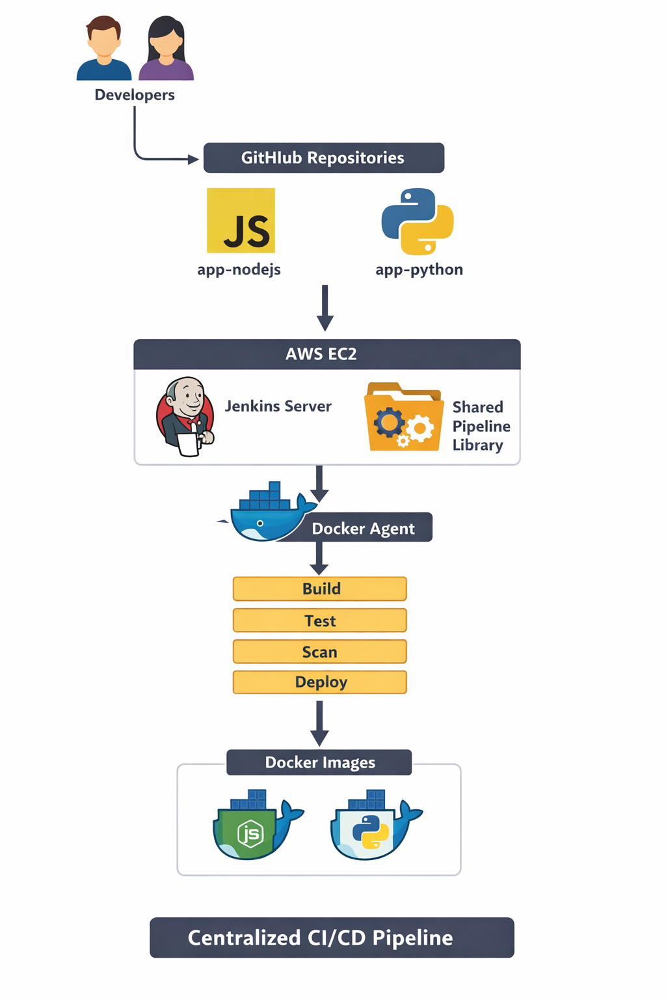
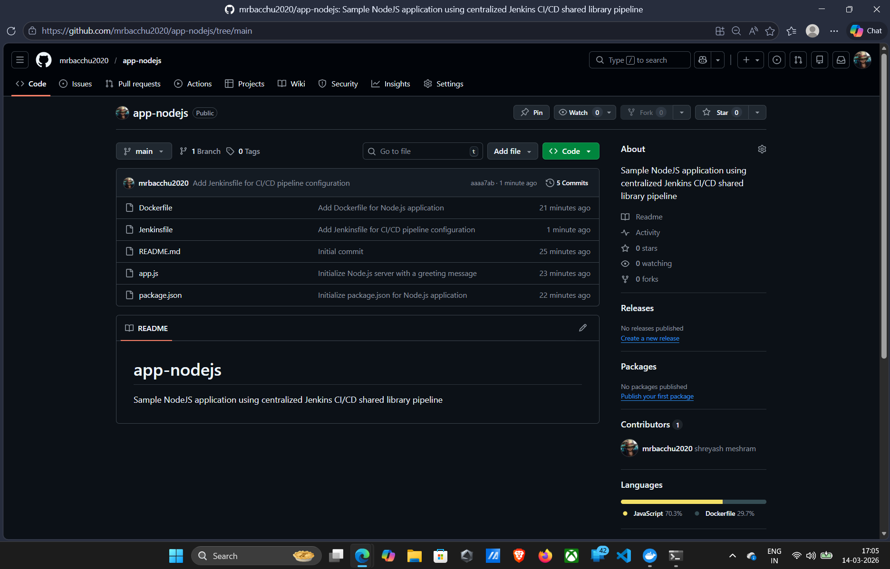
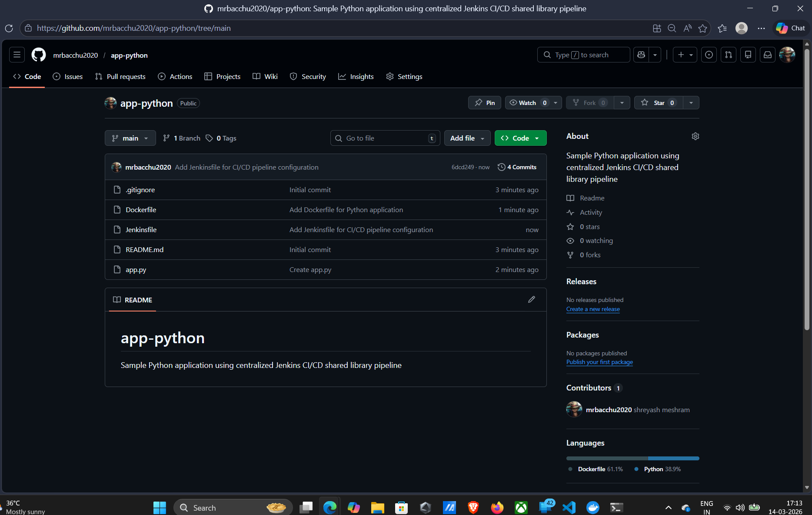
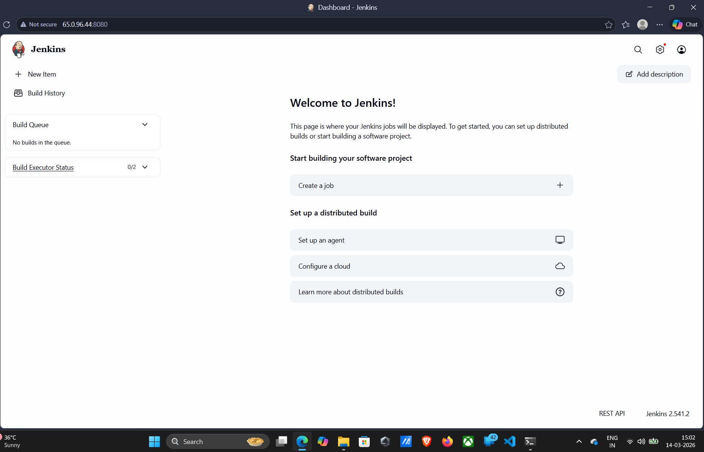
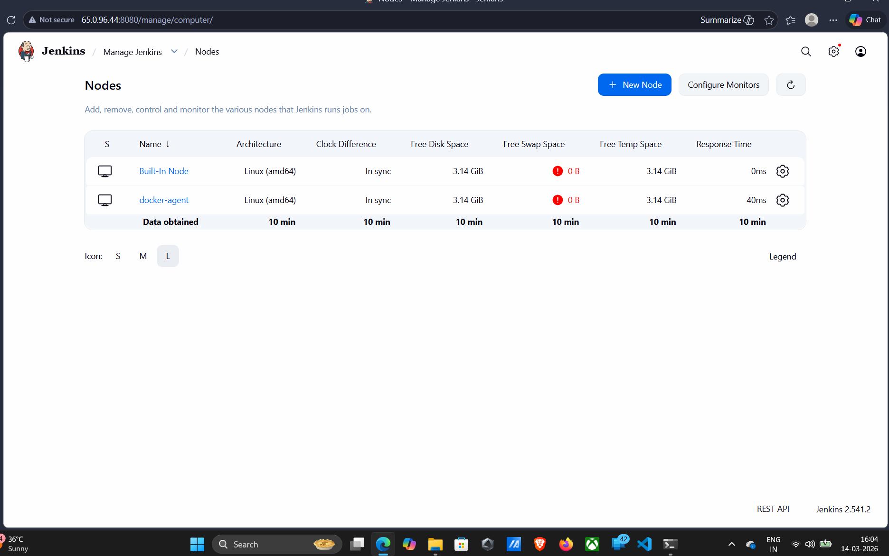
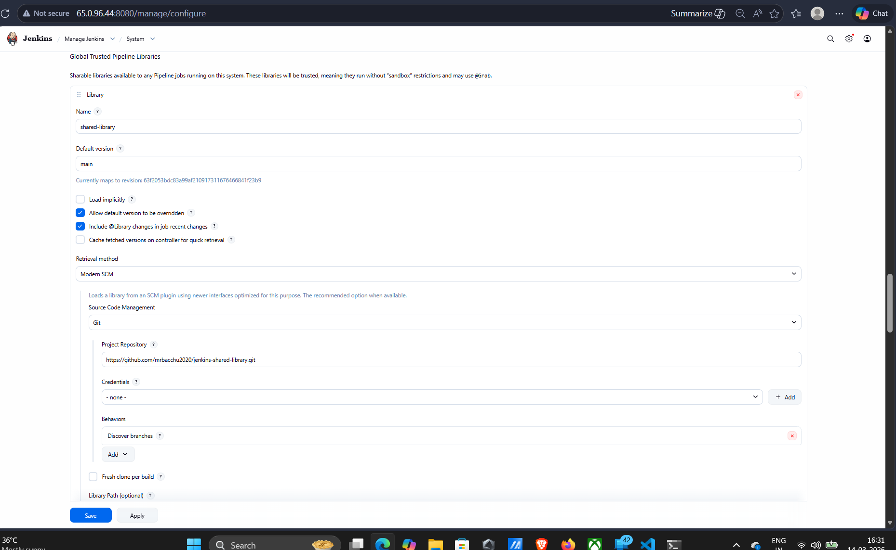
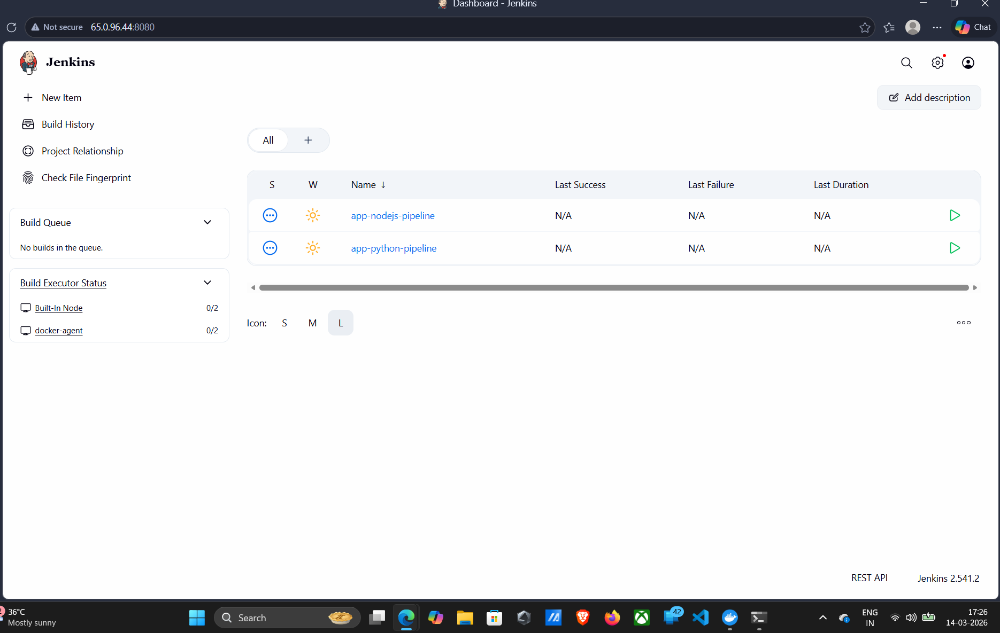

# Centralized CI/CD Platform using Shared Jenkins Infrastructure

## Project Overview

This project implements a **centralized CI/CD platform using Jenkins** to support multiple applications using a **shared pipeline library**.

Instead of maintaining separate Jenkins servers and pipelines for each project, a **single Jenkins platform** is used to standardize the build, test, security scanning, and deployment process.

This solution improves:

* CI/CD consistency
* Infrastructure efficiency
* Security practices
* Pipeline reusability

---

# Technologies Used

* Jenkins
* GitHub
* AWS EC2
* Docker
* Jenkins Shared Library

---

# Project Architecture

Developers push code to GitHub repositories. Jenkins automatically pulls the code, executes standardized pipeline stages through the shared library, and builds Docker images.

Pipeline flow:

Developers → GitHub Repositories → Jenkins Server (EC2) → Shared Pipeline Library → Jenkins Agent → Build → Test → Scan → Deploy → Docker Images

---

# Architecture Diagram

Add your architecture image here.

```
📸 Screenshot Location
docs/architecture-diagram.png
```

Example:



---

# GitHub Repositories

## Shared Jenkins Library

Repository:


[View Jenkins Shared Library Repository](https://github.com/mrbacchu2020/jenkins-shared-library)


Structure:

```
jenkins-shared-library
│
└── vars
    └── cicdPipeline.groovy
```

---

## NodeJS Application Repository

Repository:

```
https://github.com/mrbacchu2020/app-nodejs
```

Structure:

```
app-nodejs
│
├── app.js
├── package.json
├── Dockerfile
└── Jenkinsfile
```

📸 Screenshot to add here

```
docs/nodejs-repo.png
```

Example:



---

## Python Application Repository

Repository:

```
https://github.com/mrbacchu2020/app-python
```

Structure:

```
app-python
│
├── app.py
├── Dockerfile
└── Jenkinsfile
```

📸 Screenshot to add here

```
docs/python-repo.png
```

Example:



---

# Jenkins Infrastructure Setup

Jenkins server was deployed on **AWS EC2** and configured with Docker build agents.

Setup steps:

1. Launch EC2 instance
2. Install Java
3. Install Jenkins
4. Install Jenkins plugins
5. Configure Jenkins agent
6. Configure credentials
7. Connect shared library

📸 Screenshot

```
docs/jenkins-dashboard.png
```

Example:



---

# Jenkins Agent Configuration

A Jenkins build agent named **docker-agent** was configured to execute builds.

Agent configuration:

Node name: docker-agent
Executors: 1
Launch method: SSH
Label: docker

📸 Screenshot

```
docs/jenkins-nodes.png
```

Example:



---

# Jenkins Shared Library Configuration

The shared library was configured under:

Manage Jenkins → System → Global Pipeline Libraries

Library Name:

```
shared-library
```

📸 Screenshot

```
docs/shared-library-config.png
```

Example:



---

# Jenkins Pipelines

Two Jenkins pipeline jobs were created:

```
app-nodejs-pipeline
app-python-pipeline
```

📸 Screenshot

```
docs/multi-pipeline-dashboard.png
```

Example:



---

# CI/CD Pipeline Stages

Each pipeline executes the following stages:

1. Checkout
2. Build
3. Test
4. Scan
5. Deploy

Example pipeline output:

📸 Screenshot

```
docs/pipeline-stage-view.png
```

Example:


---

# Docker Image Build

The build stage creates Docker images.

Example command executed by Jenkins:

```
docker build -t shreyash274/app-nodejs:latest .
```

📸 Screenshot

```
docs/docker-build-output.png
```

Example:


---

# Project Deliverables

This project delivers:

* Centralized Jenkins CI/CD platform
* Jenkins shared library
* Multi-application pipelines
* Automated Docker builds
* Role-based access control

---

# Key Learning Outcomes

This project demonstrates practical DevOps skills including:

* CI/CD pipeline automation
* Jenkins administration
* Shared Jenkins libraries
* Docker containerization
* AWS infrastructure deployment
* Multi-project CI/CD platform design

---

# Conclusion

The centralized Jenkins platform successfully supports multiple applications using a shared pipeline architecture. This approach improves maintainability, scalability, and consistency of CI/CD workflows.

Future improvements may include:

* Kubernetes deployment
* Security scanning tools
* Infrastructure as Code
* Automated testing frameworks
